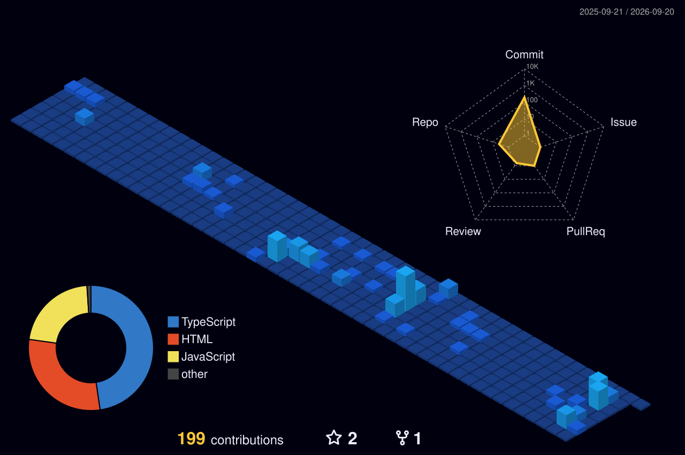

[>)](https://git.io/typing-svg)

<strong>안녕하세요 힘든 일도 끝까지 해내기 위해 노력하는 프론트엔드 개발자 서지유입니다</strong>

제가 할 수 있는 일의 한계를 돌파하고, 성장하며 다음단계로 넘어가는 것을 즐깁니다.

여러가지를 경험하고 도전하며 다양한 능력을 쌓기 위해 노력합니다.

<h3 align="center">Languages</h3>

  &nbsp
  &nbsp
  &nbsp
  &nbsp

<h3 align="center">Tech Stack</h3>

    &nbsp
    &nbsp
    &nbsp
  &nbsp
    &nbsp

  &nbsp
    &nbsp
    &nbsp

 

<h3 align="center">Tools</h3>

  &nbsp
  &nbsp
  &nbsp
  &nbsp

 

 
 

  

  

  

